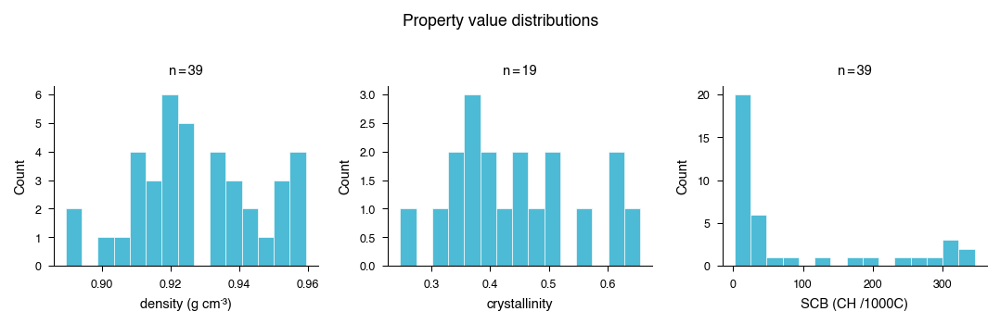
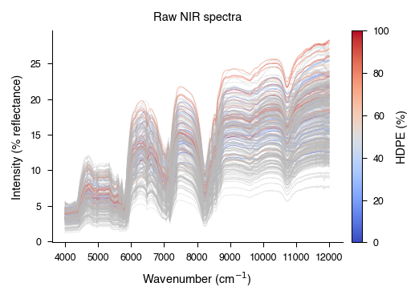
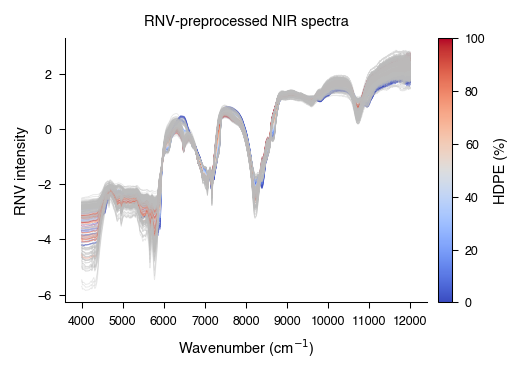
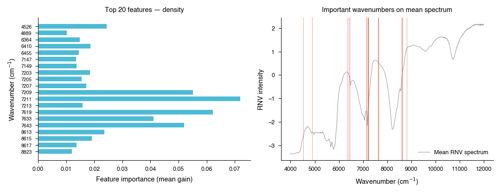
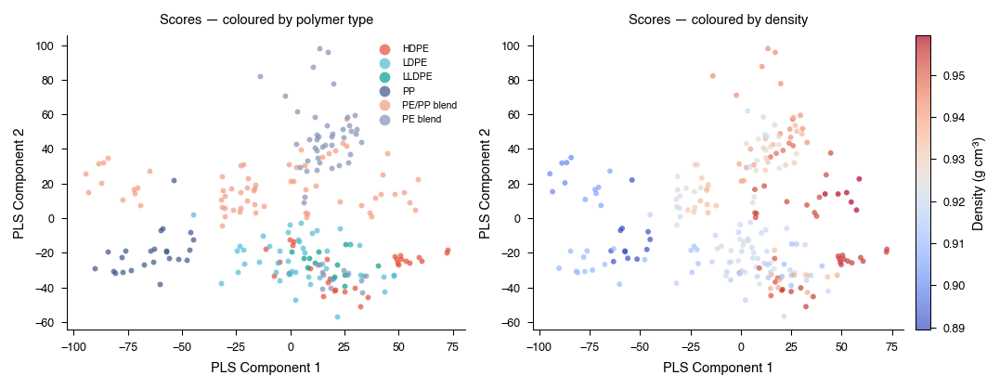
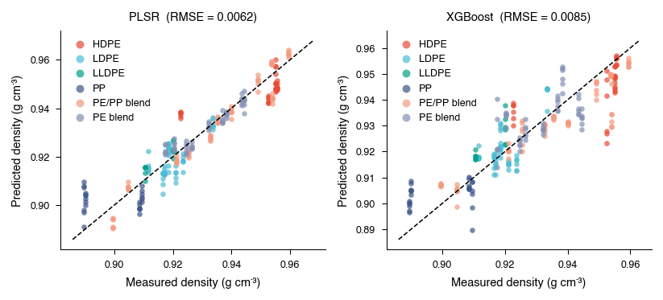
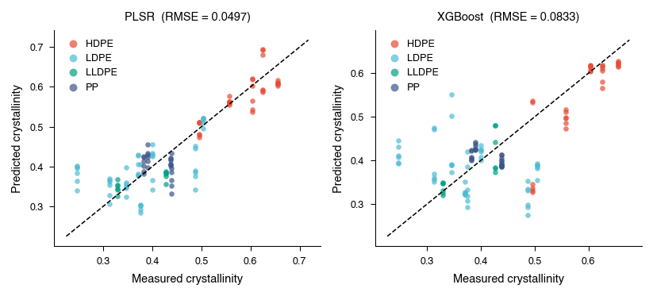
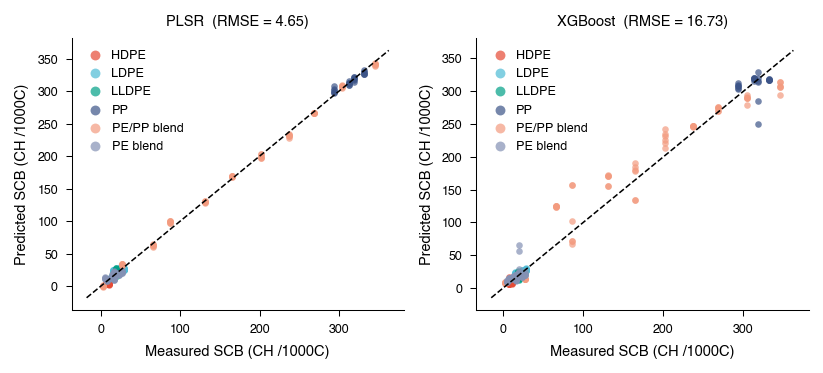
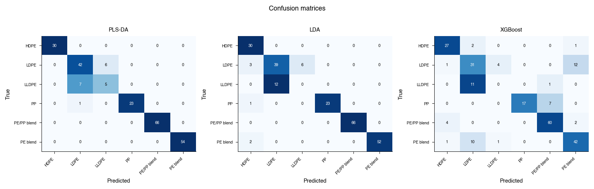

# Predicting polymer properties from NIR spectra

**Goal**: proof-of-concept attempt to determine how accurately NIR spectra can be used to predict the physical state of polyolefins using a publicly avialable dataset of NIR spectra, plus measurements of density, crystallinity, and short-chain branching for the same samples. Quick search did not surface any public datasets for PET, or any paired datasets containing spectra and melt flow rate measurements.

**Summary**: for polyoleifins, density, crystallinity, short-chain branching, and polymer identity can be estimated from NIR spectra. Estimating a broader state vector (e.g. Mw, degradation markers, etc.) would require generating a new proprietary dataset to test.

## Dataset

- **39 polyolefin samples**: HDPE, LDPE, LLDPE, PP, PE/PP blends, PE blends
- **6 NIR replicate spectra** per sample (raw + preprocessed)
- **Lab measurements**:
  - Density (g cm⁻³)
  - Crystallinity (%)
  - Short-chain branching — SCB (CH₃/1000C)

Note that crystallinity measurements exist only for the 19 non-blended samples. Density and SCB are available for all 39 samples.

**Distributions of measured properties**

---

## Preprocessing

Raw NIR spectra are all over the place. First, apply Robust Normal Variate (RNV) correction - seems to be a standard and robust scatter-correction technique. RNV dramatically reduces baseline and scaling differences, while preserving the relevant absorption features.

| Raw NIR spectra | RNV-preprocessed NIR spectra |
|---|---|
|  |  |

---

## Predicting physical properties

Try training two models on the raw spectra and measured property values. Model 1 = partial least suqares regression (PLSR, seems frequently used for spectral analysis), and Model 2 = XGBoost.

### XGBoost
Once trained, we can check the importance that the XGBoost model assigns to each of the features (wavenumbers). TODO: see if these wavenumbers are chemically relevant - likely. Top 20 most important features for prediction of density below.

**XGBoost feature importance (density)**

### Partial least squares regression
Once trained, we can view all of the spectra projected onto two dimensions of the latent space by the model, and see clear clustering by polymer. If we colour by the actual measured density of those same samples, we can see a smooth gradient - proves that the latent variables are chemically meaningful.

**PLS latent space**

### Comparison of performance - XGBoost vs PLSR

Compare prediction performance with root means suquared error (RMSE).  Performance of the two models shows that PLSR wins at prediction of all three properties, with a lower RMSE:

| Property       | PLSR RMSE              | XGBoost RMSE           |
|----------------|------------------------|------------------------|
| **Density**    | 0.0062 g cm⁻³     | 0.0085 g cm⁻³         |
| **Crystallinity** | 0.0497          | 0.0833                |
| **SCB**        | 4.65 CH₃/1000C    | 16.73                 |

---

**Predictions (density, crystallinity, SCB)**

*PLSR produces tigher predictions across all metrics. XGBoost shows significant deviation on crystallinity and SCB, likely overfitting the data*

---

## Classification - polymer type identification

Tried three classifiers to distinguish the six classes (HDPE, LDPE, LLDPE, PP, PE/PP blend, PE blend):

- **PLS-DA** — best overall
- **LDA** — also very good
- **XGBoost** — more confusion

Q: would this model be sufficiently sensitive to different grades of the same polymer? Especially if NIR measurements are being performed in a noisier environment?

**Confusion matrices**

